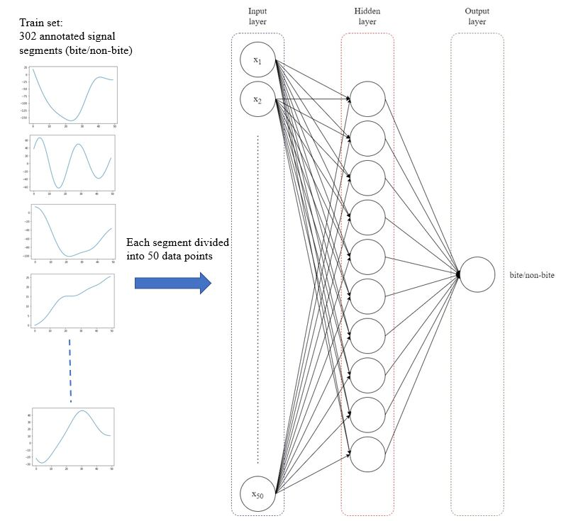

# bite_detection_neural_network

   

This is further development of online bine detection algorithm. In this project, a simple two-layer neural network is designed for prediction of bite and non-bite segment over a chewing sequence. The input layer and the hidden layer contain 50 units and 10 units respectively, while a single unit predicts the event at output layer. There are 452 samples splitted into train/test set with 70-30 percentage. Training accuracy of 99.34% and testing accuracy of 91.54% can be achieved after fine-tuning the hyperparameters.

## Requirements
tensorflow 1.15.0,
numpy,
h5py,
pandas,
matplotlib

## Wiki
Run TensorFlow_BiteDetection.ipynb to see algorithm's workflow step by step. Hypermarameters can be adjusted to give different results in training and testing process.

## Future work

Future work includes test in different architectures of deep neural network, including recurrent neural networks (RNN) and long short-term memory models (LSTM)
